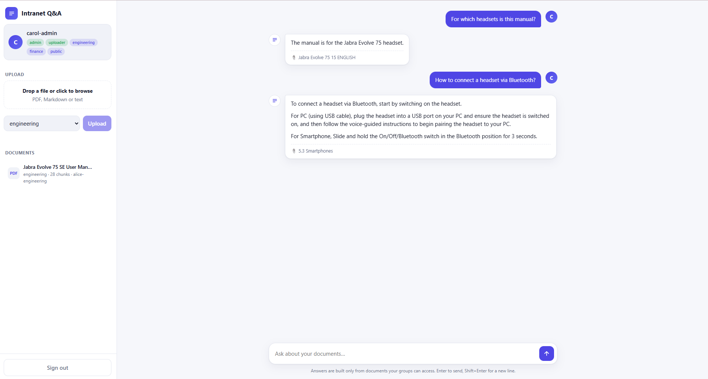

# Intranet Q&A

A **permission-aware document Q&A (RAG) service** built with Spring Boot and Spring AI.
Upload PDFs or Markdown, ask questions in a chat UI, and get answers built **only from
documents the signed-in user is allowed to see**. Runs fully locally and for free with
[Ollama](https://ollama.com), or against any OpenAI-compatible API.




## Why this project

Most RAG demos ignore the hard part of shipping RAG inside a company: **not every employee
may read every document.** Here that is the main feature. Every indexed chunk is tagged with
the group allowed to read it, and every chat request is filtered by the caller's own groups
(taken from their Keycloak JWT) **before retrieval runs**, so the model is never handed
context the user shouldn't see. Two users ask the same question and get different, correctly
scoped answers.

## Features

- **Permission-aware retrieval:** per-request vector-store filter built from the JWT `document_groups` claim
- **Chat UI:** login, upload, and streaming chat in a single dependency-free page (dark/light, mobile-friendly)
- **Document management:** upload (PDF, Markdown, text), list, delete (removes the record *and* all its vectors), duplicate detection
- **Role-based access:** Keycloak realm roles (`user`, `uploader`, `admin`); uploaders can only manage groups they belong to
- **Vendor-neutral models:** chat and embeddings go through an OpenAI-compatible API, so Ollama works with config only
- **MCP server:** document-lookup tools are exposed to external MCP clients as well as to the chat model
- **Real backend plumbing:** Flyway migrations, Spring Security resource server, Testcontainers integration tests

## Architecture

```
 Browser UI ──login──▶ Keycloak (JWT: roles + document_groups)
     │
     │ Bearer token
     ▼
 Spring Boot ── SecurityConfig (JWT resource server, role rules)
     │
     ├─ POST   /api/documents ─▶ IngestionService: read → split → tag(allowedGroup, sourceId) → embed → pgvector
     ├─ GET    /api/documents      DELETE /api/documents/{id}
     ├─ GET    /api/me
     └─ POST   /api/chat ──▶ ChatClient + QuestionAnswerAdvisor
                               filter: allowedGroup in [caller's groups]
                                   │
                                   ▼
                       PgVectorStore (Postgres + pgvector)
                                   │
                                   ▼
                  Chat + embedding model (Ollama or OpenAI-compatible)
```

## Stack

Java 25 · Spring Boot 4.1 · Spring AI 2.0 · Spring Security (OAuth2 resource server) ·
Keycloak 26 · Spring Data JPA + Flyway · PostgreSQL + pgvector · Testcontainers · Maven

## Tested on

Verified end to end on Java 25, Spring Boot 4.1.0, Spring AI 2.0.1 (local Ollama models).

## Quick start (free, local, no API key)

**Prerequisites:** Java 25, Maven 3.9+, Docker, and [Ollama](https://ollama.com).

```bash
# 1. Models (one-time)
ollama pull llama3.2
ollama pull nomic-embed-text

# 2. Postgres (pgvector) and Keycloak (pre-loaded realm and test users)
docker compose up -d postgres keycloak
```

```bash
# 3a. Run the app — macOS/Linux
export OPENAI_API_KEY=ollama
export AI_BASE_URL=http://localhost:11434/v1
export AI_CHAT_MODEL=llama3.2
export AI_EMBEDDING_MODEL=nomic-embed-text
export AI_EMBEDDING_DIMENSIONS=768
mvn spring-boot:run
```

```powershell
# 3b. Run the app — Windows PowerShell
$env:OPENAI_API_KEY="ollama"
$env:AI_BASE_URL="http://localhost:11434/v1"
$env:AI_CHAT_MODEL="llama3.2"
$env:AI_EMBEDDING_MODEL="nomic-embed-text"
$env:AI_EMBEDDING_DIMENSIONS="768"
mvn spring-boot:run
```

Open **http://localhost:8080** and sign in.

> **Note:** `AI_BASE_URL` must end in `/v1`. `AI_EMBEDDING_DIMENSIONS` must match the embedding
> model (768 for `nomic-embed-text`, 1536 for OpenAI `text-embedding-3-small`). The vector table is
> created at startup, so if you switch embedding models, drop it first:
> `docker compose exec postgres psql -U intranetqa -d intranetqa -c "DROP TABLE IF EXISTS vector_store;"`
> and restart.

### Using OpenAI instead

```bash
export OPENAI_API_KEY=sk-...
mvn spring-boot:run          # defaults: gpt-4o-mini + text-embedding-3-small (1536 dims)
```

## Demo users

All passwords are `password`.

| User | Roles | Groups | Can do |
|---|---|---|---|
| `alice-engineering` | user, uploader | engineering, public | chat, upload/delete in her groups |
| `bob-finance` | user | finance, public | chat only |
| `carol-admin` | user, uploader, admin | engineering, finance, public | everything |

### See the permission model work

1. Sign in as **alice**, upload a PDF to the `engineering` group, and ask a question about it. You get a grounded answer with the source cited.
2. Sign out, sign in as **bob**, and ask the same question. He gets *"I don't have information about that"* because retrieval never sees the engineering chunks.
3. As bob, try to upload: the UI has no upload panel, and the API returns `403`.

## API

All endpoints need a Bearer token (get one from Keycloak's token endpoint) except `/actuator/health`.

| Method | Path | Role | Description |
|---|---|---|---|
| `POST` | `/api/chat` | any user | `{"question": "..."}` → `{"answer": "..."}` |
| `POST` | `/api/chat/stream` | any user | same request; answer streamed token by token as server-sent events (`data: {"t":"..."}`) |
| `GET` | `/api/me` | any user | username, roles, document groups |
| `POST` | `/api/documents` | uploader/admin | multipart: `file`, `allowedGroup` → `201`; `409` if duplicate |
| `GET` | `/api/documents` | uploader/admin | documents in your groups (all for admin) |
| `DELETE` | `/api/documents/{id}` | uploader/admin | deletes the record and all its vectors |

## Configuration

| Env var | Default | Purpose |
|---|---|---|
| `OPENAI_API_KEY` | `changeme` | API key (any non-empty value for Ollama) |
| `AI_BASE_URL` | `https://api.openai.com/v1` | OpenAI-compatible endpoint (Ollama: `http://localhost:11434/v1`) |
| `AI_CHAT_MODEL` | `gpt-4o-mini` | Chat model |
| `AI_EMBEDDING_MODEL` | `text-embedding-3-small` | Embedding model |
| `AI_EMBEDDING_DIMENSIONS` | `1536` | Must match the embedding model |
| `DB_HOST` / `DB_PORT` / `DB_NAME` / `DB_USER` / `DB_PASSWORD` | localhost / 5432 / intranetqa ×3 | Postgres |
| `KEYCLOAK_ISSUER_URI` | `http://localhost:8081/realms/intranetqa` | JWT issuer |

## Testing

```bash
mvn test        # needs Docker for the Testcontainers Postgres
```

The integration test boots the real Spring context against a throwaway Postgres+pgvector
container with the chat/embedding models mocked, so it needs no API key and makes no network
calls. It checks wiring (security rules, Flyway, vector store autoconfiguration), not answer quality.

## Design decisions and known limitations

- **Filter at retrieval, not in the prompt.** Access control is enforced in the vector query, not by asking the model to behave.
- **One group per document.** The vector-store filter DSL matches scalar fields, so a document for several groups is uploaded once per group instead of storing a list.
- **Original files aren't stored.** Only extracted text chunks (in pgvector) and a metadata row are kept, so re-indexing needs a re-upload. Object storage (e.g. MinIO) is the natural next step.
- **Dev-grade login.** The UI uses Keycloak's direct-grant (password) flow because it keeps the demo to one static page. A production deployment should use the authorization-code flow with PKCE.
- **Streaming has no tools.** Tool methods read the caller from a thread-local security context, which doesn't follow a streamed response onto other threads, so `/api/chat/stream` runs retrieval only. Passing the caller through Spring AI's tool context would restore it.
- **Small local models are small.** `llama3.2` answers well on short factual questions but can be vague on complex ones; quality improves with a larger model through the same config.

## Roadmap

- Evaluation harness (fixed question/expected-answer set, graded automatically)
- Store original files; re-index on embedding-model change
- Authorization-code + PKCE login
